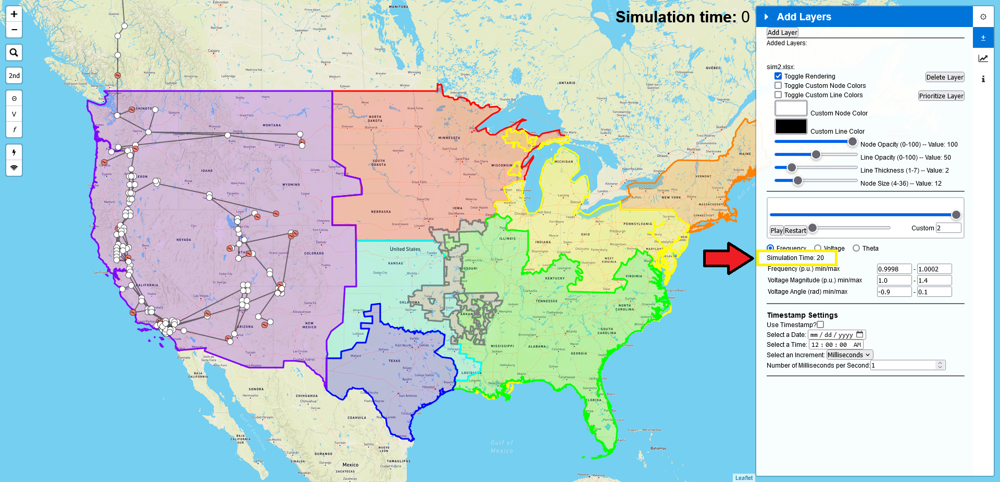

.. _idr:

==========================
Independent Data Reader
==========================

The Independent Data Reader (IDR) is an extension of the MultiLayer functionality,
allowing AGVis to interpet and animate simulation data provided by users in an Excel file.
The features relating to the Independent Data Reader are appended to the MultiLayer
features if a file is compatible with the IDR. It is also found in menu with the **+/-** icon.

Add Layer
===============

When you open up the MultiLayer menu, you will only see the **Add Layer** button.

When you click on it, it will request an Excel file.
***The IDR requires an additional sheet, O_His, along with the Bus and Line sheets required for MultiLayer.*** 

O_His
-----------------

The O_His sheet stores the simulation data for three variables, Frequency, Voltage
Magnitude (also referred to simpy as Voltage), and Voltage Angle (also referred to as Theta).
It expects 2 + (# of buses * 3) columns. Every row after the first row, is the data for a
given time. The first row is a label row, while the first column is an index column. The first
row of the first column must be the number of buses in the simulation. The second column,
labeled "t", contains the timesteps of the simulation. The (# of buses * 3) columns after the
first two consist of the data for each bus for each variable at a given time. The first *n* columns
(where n is the # of buses) after the time column contain data for the Voltage Magnitude. The
second *n* columns contain data for the Voltage Angle. The third *n* columns contain data for
the Frequency. 

Theoretically, each *n* columns for Frequency, Voltage Magnitude, and Voltage Angle could be
replaced with *n* worth of different simulation data. These variables are simply the ones used
originally with AGVis, and thus are used in the current version.

Optional S_Set
----------------------------

The S_Set sheet is a completely optional sheet that allows users to preset certain configuration
options. S_Set expects these columns: show, freq, v_mag, v_ang, tstamp, tdae, ttime, tinc,
and tnum. The show column is where you specify which variable, Frequency, Voltage Magnitude
or Voltage Angle, you would like the animation to show. It expects **f** (Frequency),
**v** (Voltage Magnitude), or **t** (Voltage Angle). The freq, v_mag, and v_ang columns
are used to set the range for those variables. The minimum should be set in the first cell
underneath the column label, and the maximum should be set in the second cell underneath the
label. tstamp indicates if you would like to use the custom Timestamp feature. It expects
**yes** or **no**. tdate sets the date you would like to use with the Timestamp. The date
should be formatted as **YYYY-MM-DD**. time, similarly sets the hours, minutes, and seconds
for the Timestamp. It uses 24-hour time formatted as **HH:MM:SS**. tinc is the time increment
you would like the timer step in. It expects **Milliseconds**, **Seconds**, **Minutes**,
**Hours**, or **Days**. tnum is how many of that increment you would like to timer to
increase by in a given second. It expects a **positive integer or decimal**.
 
Here is an edited version of the wecc.xlsx file from the AGVis cases directory on GitHub with
simulation data included:
[sim_example.xlsx](https://github.com/CURENT/agvis/files/10785612/sim_example.xlsx)

CSV Reader
----------------------------

As of the v3.2.0 update, the IDR can accept CSV files along with an Excel file. This feature
was included so that users could upload an ANDES input file along with an ANDES output file without
having to make modifications. When using the CSV file reader, AGVis expects an Excel file to be uploaded as well.
This Excel file should contain the MultiLayer (Bus and Line) data. The CSV file should only contain simulation data.
The CSV file can be in one of two formats: IDR and ANDES Output. The IDR format is the same style listed in the O_His section.
The ANDES Output format is exactly that--an ANDES output file. The CSV Reader has to make certain assumptions to work with this format.
Specifically, it assumes that the Time column comes before the variable columns so that it can determine how much of each column to read,
and it assumes that the number of buses corresponds to the variable (Voltage Frequency, Magnitude, and Angle) with the most entries. If a
simulation variable has less entries than the assumed bus number, it will be padded to meet that number. 

The ANDES Output format is also accepted in the O_His sheet when uploading a single Excel file.

IDR Options
==================

After uploading a valid file set, the MultiLayer menu will fill with both the MultiLayer options
and the IDR options:

Playback Bar
----------------------------

Once the file has finished uploading, the Playback Bar will appear underneath the Node settings.

Pressing the "**Restart**" button will reset the simulation back to the beginning. Pressing the
"**Pause**" button will pause the simulation. Specific times in the simulation can be selected by
manually moving the top slider.

The speed at which the simulation plays back can be adjusted as well by moving the bottom slider.
A custom speed multiplier can be set by moving the slider all the way to the left.

.. image:: diagrams/idr/playback2.png
   :alt: playback2
   :width: 960px

Shown Variable
----------------------------

Underneath the Playback Bar are the shown variable buttons. These buttons determine what set of
data is used for the simulation animation. The **Frequency** button is clicked by defaut.

Variable Range
----------------------------

The ranges underneath the shown variable buttons and timer are for adjusting the heat mapping
for the simulation. The default for Frequency is **0.9998 - 1.0002**. The default for Voltage
Magnitutde is **0.8 - 1.2**. The default for Voltage Angle is **-1 - 1**.

Here are before and after shots for each variable:

**Frequency**

**Voltage Magnitude**

**Voltage Angle**

Timer
----------------------------

The timer is underneath the shown variable buttons. It updates according to the length of the
simulation. By default it counts up from the minimum time given in the data, but it can be adjusted
using the Timestamp settings.

Timestamps
==================

Underneath the Node and Configuration settings are the Timestamp settings.

If the timestamp feature is active, the simulation timer under the variable ranges will change to
reflect the settings. The timestamp feature can only be activated if all of its inputs are valid. The
inputted time should be the time you want the simulation to start at.

Use Timestamp?
----------------------------

A simple Yes/No toggle for whether you want to use the timestamp feature. If it is clicked, it will
use the given time, assuming a valid input. If it is set to unclicked, the timer will start at 0 and count
up to the length of the simulation in seconds. The default setting is "**unclicked**".

Select a Date
----------------------------

The input for the starting date of the simulation. Clicking on it will bring up a datepicker. The date
can also be typed in using "**MM/DD/YYYY**" format. This input has no default. If you want to
use a timestamp, you must choose a date first.

Select an Increment
----------------------------

A list of the available time increments to use in the simulation. Essentially, each second of the simluation
will increment the timer by a certain amount of the specified increment value. The available increments are
**Milliseconds**, **Seconds**, **Minutes**, **Hours**, and **Days**. The default increment is
**Milliseconds**.

Number of **Increments** per Second
-----------------------------------------------------------------

The number of time increments you want the timer to advance during a second of the simulation. This can
take any non-negative (>= 0), rational number as an input. Decimal inputs work as you might expect: using
**1.5 Days**, for example, is equivalent to using **36 Hours**. The default value is **1**. If you put
in 0, the timer will simply stay at the selected date and time throughout the entire simulation.

